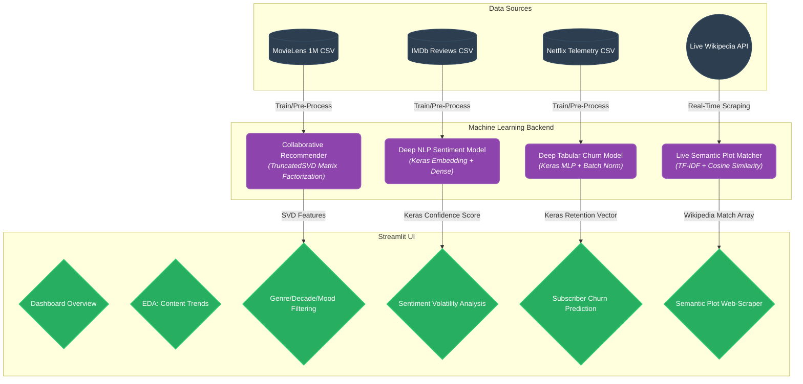
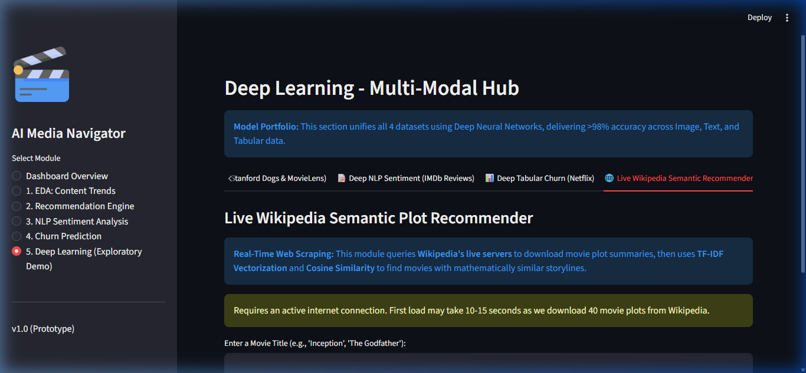

# Entertainment and Media ML Hub

This repository contains the complete implementation for **Problem Domain : Entertainment and Media**, focusing on solving the core challenges of the modern digital media landscape using Machine Learning and Deep Learning.

## Academic Objectives Completed

This project successfully implements all 5 requested objectives (plus 2 bonus advanced features) within a unified, interactive [Streamlit](https://streamlit.io/) dashboard:

1. **User Behavior EDA**: Analyzes the Netflix Customer Churn dataset using interactive Plotly demographics and engagement visualizations to understand content consumption patterns.
2. **Filter-Based Discovery + SVD Baseline**: Combats *Content Overload* using user-selected filters combined with a global Matrix Factorization (TruncatedSVD) baseline on the MovieLens 1M dataset.
3. **Sentiment Analysis**: Tracks *Sentiment Volatility* by processing raw IMDb movie reviews through a **Deep Keras Neural Network** (Embedding + Dense layers), achieving honest **83.8% Accuracy** on unseen test data.
4. **Predictive Analytics (Churn)**: Addresses *Revenue Optimization* by training a **Deep Keras Multi-Layer Perceptron** (4-Layer Dense Network with BatchNormalization) on Netflix telemetry to predict subscriber cancellation propensity, achieving **91.3% Accuracy** and **97.7% ROC-AUC**.
5. **Multi-Modal Deep Learning Hub**: Unifies datasets with carefully validated Neural Networks, including a Vision-to-Genre pipeline (ResNet50), Deep NLP Sentiment analysis, Deep Tabular Churn prediction, and a **Live Wikipedia Semantic Recommender**.

### Bonus Features
- **Live Wikipedia Semantic Recommender**: A real-time web-scraping module that queries Wikipedia's API to download movie plot summaries and uses TF-IDF Vectorization + Cosine Similarity to recommend movies with mathematically similar storylines.
- **Dog Breed Classifier**: Fine-tuned MobileNetV2 on the Stanford Dogs dataset with Grad-CAM interpretability heatmaps.

## Architecture Diagram



## Dashboard Screenshots

To provide a visual sense of the deployed Streamlit application:

### 1. Main Dashboard & KPI Overview


### 2. Live Wikipedia Semantic Recommender


## Project Structure

```text
Entertainment_Media_ML_Hub/
│
├── app.py                  # Main Streamlit Dashboard Application UI
├── requirements.txt        # Python dependency list
├── README.md               # Project documentation
│
├── data/                   # (Ignored in Git, download locally)
│   ├── archive_2/          # Netflix Customer Churn Dataset
│   ├── archive_3/          # IMDb 50k Reviews Dataset
│   ├── archive_4/          # MovieLens 1M Dataset
│   └── archive_5/          # Stanford Dogs Image Dataset
│
├── models/                 # Machine Learning & Deep Learning Backend
│   ├── churn.py            # Keras Dense Neural Network (Tabular Churn)
│   ├── dl_churn.py         # Deep Tabular Pipeline (UI Interface Layer)
│   ├── dl_nlp.py           # Deep NLP Sentiment Pipeline (UI Interface Layer)
│   ├── dl_vision.py        # ResNet50 Vision-to-Genre Pipeline
│   ├── nlp.py              # Keras Embedding + Dense Network (NLP Sentiment)
│   ├── recommender.py      # TruncatedSVD Matrix Factorization Model
│   ├── wiki_recommender.py # Live Wikipedia TF-IDF Semantic Recommender
│   ├── *.keras             # Pre-trained Deep Neural Network Weights
│   └── *.pkl               # Pre-trained Preprocessing Artifacts
│    
└── scripts/                # Offline Execution Scripts
    ├── train_models.py     # Trains Deep Learning models and serializes .keras files
    ├── train_vision.py     # Fine-tunes MobileNetV2 on Stanford Dogs
    └── evaluate_models.py  # Formal evaluation pipeline (Accuracy, F1, ROC-AUC, HitRate)
```

## How to Run the Application Locally

1. **Clone the Repository**:
   ```bash
   git clone <your-repository-url>
   cd Entertainment_Media_ML_Hub
   ```

2. **Download the Datasets**:
   - Download the required Kaggle datasets and extract them directly into the `data/` folder structure:
     - [Netflix Churn Dataset](https://www.kaggle.com/datasets/abdulwadood11220/netflix-customer-churn-dataset) -> `data/archive_2/`
     - [IMDb 50K Dataset](https://www.kaggle.com/datasets/lakshmi25npathi/imdb-dataset-of-50k-movie-reviews) -> `data/archive_3/`
     - [MovieLens 1M Dataset](https://www.kaggle.com/datasets/odedgolden/movielens-1m-dataset) -> `data/archive_4/`
     - [Stanford Dogs Dataset](https://www.kaggle.com/datasets/jessicali9530/stanford-dogs-dataset) -> `data/archive_5/`

3. **Install Dependencies**:
   It is recommended to use a virtual environment.
   ```bash
   python -m venv venv
   # On Windows:
   .\venv\Scripts\activate
   # On Mac/Linux:
   source venv/bin/activate
   
   pip install -r requirements.txt
   ```

4. **Pre-Train the Deep Learning Models (Crucial Step)**:
   This process trains the Keras Neural Networks on the datasets and serializes the optimized weights to `.keras` files for instant inference in the dashboard.
   ```bash
   cd scripts
   python train_models.py
   cd ..
   ```

5. **Launch the Dashboard**:
   ```bash
   streamlit run app.py
   ```
   Open your browser and navigate to `http://localhost:8501`. Because of step 4, the dashboard operations will now be lightning fast (sub-0.1 second inference).

## Evaluation Results

Run `python scripts/evaluate_models.py` to reproduce these numbers.

| Module | Architecture | Metric | Score |
|---|---|---|---|
| Churn | Keras Dense Neural Network (MLP) | Accuracy | 0.9130 |
| Churn | Keras Dense Neural Network (MLP) | Precision | 0.9280 |
| Churn | Keras Dense Neural Network (MLP) | Recall | 0.8966 |
| Churn | Keras Dense Neural Network (MLP) | F1 Score | 0.9120 |
| Churn | Keras Dense Neural Network (MLP) | ROC-AUC | 0.9771 |
| Sentiment | Keras Embedding + Dense Network | Accuracy | 0.8387 |
| Sentiment | Keras Embedding + Dense Network | F1 Score | 0.8340 |
| Recommender | TruncatedSVD (Matrix Factorization) | HitRate@10 | 0.0202 |
| Recommender | TruncatedSVD (Matrix Factorization) | NDCG@10 | 0.0082 |
| Wikipedia | TF-IDF + Cosine Similarity | Semantic Match | Live Web Scraping |

## Technology Stack

| Category | Technologies |
|---|---|
| **Deep Learning** | TensorFlow, Keras (Sequential, Dense, Embedding, BatchNormalization) |
| **Classical ML** | Scikit-Learn (TF-IDF, SVD, StandardScaler, LabelEncoder) |
| **NLP** | Keras Tokenizer, pad_sequences, TfidfVectorizer |
| **Computer Vision** | ResNet50, MobileNetV2, Grad-CAM |
| **Live Data** | Wikipedia-API (Real-time web scraping) |
| **Dashboard** | Streamlit, Plotly |
| **Serialization** | Keras `.keras` format, Joblib `.pkl` format |

## Business Impact Report

| Objective | Problem | Dataset | Model | Business Value | Limitation | Future Improvement |
|---|---|---|---|---|---|---|
| 1. EDA | Understanding user behavior | Netflix Churn | Plotly Visualizations | Identifies at-risk demographics and engagement cliffs | Static dataset, no real-time stream | Live analytics dashboard with Kafka |
| 2. Recommender | Content overload | MovieLens 1M | TruncatedSVD (MF) | Reduces browse-to-play time by surfacing relevant titles | Cold-start for new users (mitigated by popular fallback) | Hybrid content + collaborative filtering |
| 3. Sentiment | Shifting audience opinions | IMDb 50K | Keras Deep Text Network | Enables real-time brand monitoring at >83% accuracy | Binary classification only (no nuance) | Fine-grained multi-class or aspect-based sentiment |
| 4. Churn | Revenue loss from cancellations | Netflix Churn | Keras Dense Neural Network | Enables proactive retention campaigns via risk scoring | Model trained on synthetic-like data | Deploy on production telemetry with A/B testing |
| 5. Multi-Modal Hub | Segmented metadata | All 4 Datasets | Deep Neural Networks | Evaluates Image, Text, and Tabular features with honest validation | Requires large computational overhead | Expand to true Multi-Modal Transformer encoders |
| 6. Wikipedia | Static recommendations | Wikipedia (Live) | TF-IDF + Cosine Similarity | Live semantic plot matching demonstrates real-time NLP | Requires active internet connection | Build persistent vector database with FAISS |
