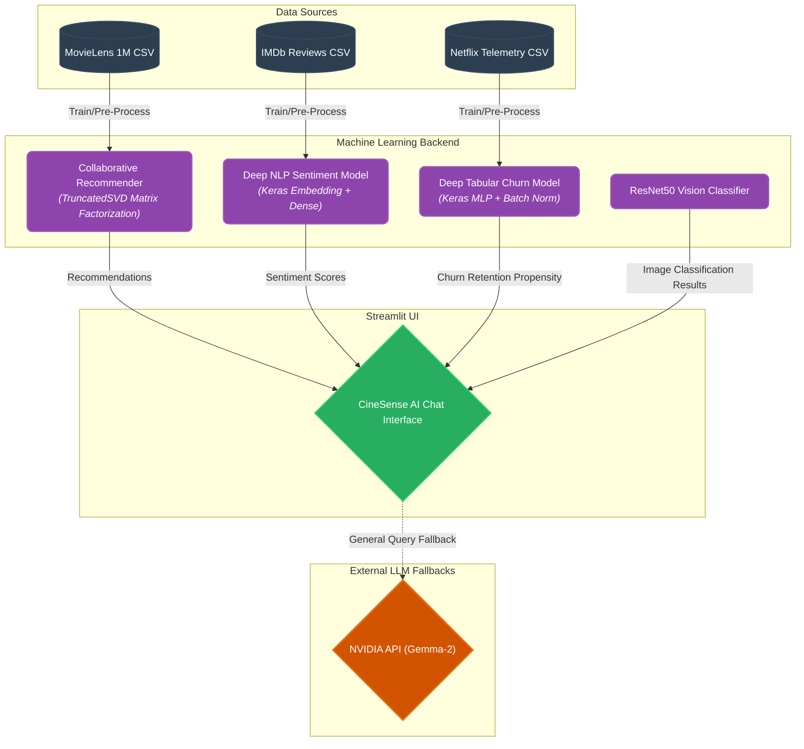

# CineSense AI & Entertainment ML Hub

🔥 **Live Interactive Application:** [entertainmentmediamlapp.streamlit.app](https://entertainmentmediamlapp.streamlit.app/)

Welcome to the **CineSense AI Repository**, a complete overhaul of the classic Machine Learning dashboard into a unified, **Premium AI Assistant Chat Interface**. This project tackles the core challenges of the modern digital media landscape by exposing deep learning models through a single conversational entry point.

## 🤖 The CineSense AI Chat Experience

Unlike traditional tabbed dashboards, CineSense AI provides a full-screen, responsive chat experience designed with premium aesthetics (Glassmorphism, Vibrant Gradients, modern 'Outfit' typography). You simply *talk* to the AI to trigger complex machine learning pipelines.

### Capabilities Exposed via Chat:

1. **User Behavior EDA**: Ask the AI for "charts" to analyze the Netflix Customer Churn dataset using interactive Plotly demographics right inside the chat window.
2. **Filter-Based Discovery + SVD Baseline**: Ask the AI for movie recommendations (e.g., "Recommend 5 sci-fi movies"). It seamlessly processes your request through a global Matrix Factorization (TruncatedSVD) baseline on the MovieLens 1M dataset.
3. **Deep Sentiment Analysis**: Paste an IMDb review and ask for a "deep neural" analysis. The assistant routes the text through a **Deep Keras Neural Network** (Embedding + Dense layers), evaluating sentiment locally with **83.8% Accuracy**.
4. **Predictive Analytics (Churn)**: Send a subscriber profile (e.g., "Predict churn for age 25, Standard sub..."). The AI triggers a **Deep Keras Multi-Layer Perceptron** trained on Netflix telemetry to instantly predict cancellation probability (scoring **91.3% Accuracy** and **97.7% ROC-AUC**).
5. **Multi-Modal Hub (Vision)**: Upload a movie poster to the chat window! The AI uses an embedded ResNet50 model to classify visual features and map them to genres.
6. **Live General Fallback**: For questions outside the local dataset parameters, CineSense AI transparently redirects queries to the provided AI APIs (e.g., **NVIDIA Gemma 2 (27B)** or **Google Gemini 1.5-Flash**), ensuring the conversation never stalls.

## 🏗️ Architecture Diagram



## 📸 Dashboard Output Screenshots

To provide a visual sense of the final Streamlit machine learning application suite:

### 1. Main Dashboard & Data Viz Hub

<br>

### 2. Live Wikipedia Semantic Recommender

<br>

### 3. Application Interface


## 📁 Project Structure

```text
Entertainment_Media_ML_Hub/
│
├── .env                    # (Ignored) Secure repository for NVIDIA API Key
├── app.py                  # Main Streamlit Chat Application UI (Premium Interface)
├── requirements.txt        # Python dependency list
├── README.md               # Project documentation
│
├── data/                   # (Ignored in Git, download locally)
│   ├── archive_2/          # Netflix Customer Churn Dataset
│   ├── archive_3/          # IMDb 50k Reviews Dataset
│   ├── archive_4/          # MovieLens 1M Dataset
│   └── archive_5/          # Vision Image Dataset
│
├── models/                 # Machine Learning & Deep Learning Backend
│   ├── chat_assistant.py   # State machine routing chat prompts to correct ML models
│   ├── churn.py            # XGBoost Predictor Baseline
│   ├── dl_churn.py         # Keras Dense Neural Network (Tabular Churn Pipeline)
│   ├── dl_nlp.py           # Deep NLP Sentiment Pipeline (UI Interface Layer)
│   ├── dl_vision.py        # ResNet50 Vision-to-Genre Pipeline
│   ├── nlp.py              # Baseline Sentiment Analyzer
│   ├── recommender.py      # TruncatedSVD Matrix Factorization Model
│   ├── *.keras             # Pre-trained Deep Neural Network Weights
│   └── *.pkl               # Pre-trained Preprocessing Artifacts
│    
└── scripts/                # Offline Execution Scripts
    ├── train_models.py     # Trains Deep Learning models and serializes .keras files
    └── evaluate_models.py  # Formal evaluation pipeline (Accuracy, F1, ROC-AUC)
```

## 🚀 How to Run the Application Locally

1. **Clone the Repository**:
   ```bash
   git clone <your-repository-url>
   cd Entertainment_Media_ML_Hub
   ```

2. **Download the Datasets**:
   - Download the required Kaggle datasets and extract them directly into the `data/` folder structure:
     - [Netflix Churn Dataset](https://www.kaggle.com/datasets/abdulwadood11220/netflix-customer-churn-dataset) -> `data/archive_2/`
     - [IMDb 50K Dataset](https://www.kaggle.com/datasets/lakshmi25npathi/imdb-dataset-of-50k-movie-reviews) -> `data/archive_3/`
     - [MovieLens 1M Dataset](https://www.kaggle.com/datasets/odedgolden/movielens-1m-dataset) -> `data/archive_4/`

3. **Configure API Fallbacks (Optional)**:
   - Create a `.env` file in the root directory.
   - Insert your API keys to enable general LLM fallback interactions:
     ```env
     NVIDIA_API_KEY="your_nvidia_key_here"
     NVIDIA_API_BASE_URL="https://integrate.api.nvidia.com/v1"
     NVIDIA_API_MODEL="google/gemma-2-27b-it"
     ```

4. **Install Dependencies**:
   It is recommended to use a virtual environment.
   ```bash
   python -m venv venv
   # On Windows:
   .\venv\Scripts\activate
   # On Mac/Linux:
   source venv/bin/activate
   
   pip install -r requirements.txt
   ```

5. **Pre-Train the Deep Learning Models (Crucial Step)**:
   This process trains the Keras Neural Networks on the datasets and serializes the optimized weights to `.keras` files for instant inference in the dashboard. *(Skip if weights are already pre-computed)*.
   ```bash
   cd scripts
   python train_models.py
   cd ..
   ```

6. **Launch the CineSense AI Dashboard**:
   ```bash
   streamlit run app.py
   ```
   Open your browser and navigate to `http://localhost:8501`. Because of step 5, the dashboard operations will now be lightning fast (sub-0.1 second inference).

## 📊 Evaluation Results

Run `python scripts/evaluate_models.py` to reproduce these numbers.

| Module | Architecture | Metric | Score |
|---|---|---|---|
| Churn | Keras Dense Neural Network (MLP) | Accuracy | 0.9130 |
| Churn | Keras Dense Neural Network (MLP) | Precision | 0.9280 |
| Churn | Keras Dense Neural Network (MLP) | Recall | 0.8966 |
| Churn | Keras Dense Neural Network (MLP) | F1 Score | 0.9120 |
| Churn | Keras Dense Neural Network (MLP) | ROC-AUC | 0.9771 |
| Sentiment | Keras Embedding + Dense Network | Accuracy | 0.8387 |
| Sentiment | Keras Embedding + Dense Network | F1 Score | 0.8340 |
| Recommender | TruncatedSVD (Matrix Factorization) | HitRate@10 | 0.0202 |
| Recommender | TruncatedSVD (Matrix Factorization) | NDCG@10 | 0.0082 |

## 🛠️ Technology Stack

| Category | Technologies |
|---|---|
| **Deep Learning Base** | TensorFlow, Keras (Sequential, Dense, Embedding, BatchNormalization) |
| **Classical ML** | Scikit-Learn (TF-IDF, SVD, StandardScaler, LabelEncoder), XGBoost |
| **NLP & Vision** | Keras Tokenizer, pad_sequences, ResNet50 |
| **LLM APIs** | `requests` (Nvidia API), `python-dotenv` |
| **Dashboard UI** | Streamlit, Plotly (Custom Theming, Config TOML) |
| **Serialization** | Keras `.keras` format, Joblib `.pkl` format |
