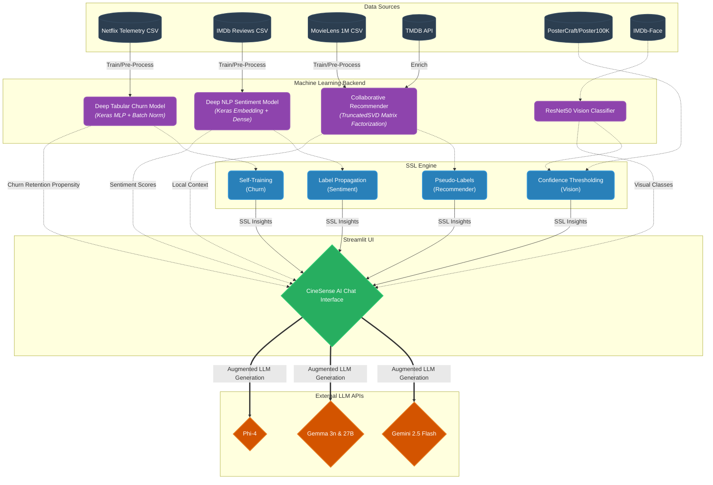
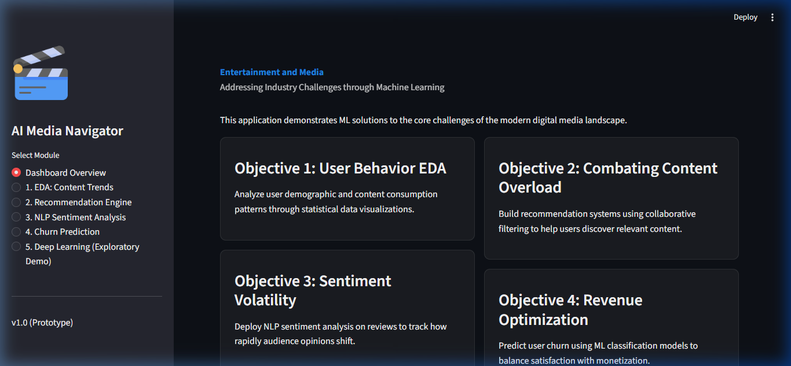
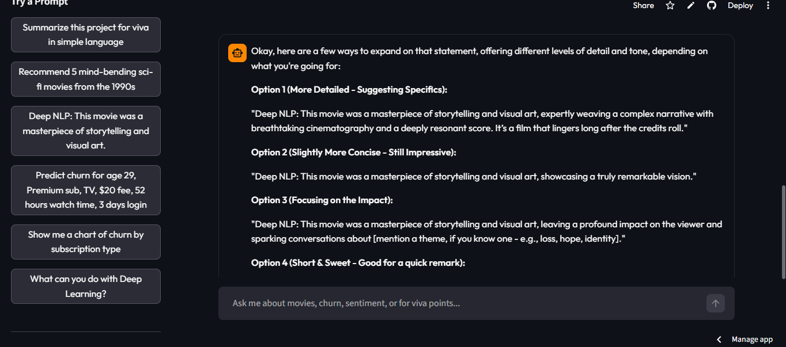

# CineSense AI & Entertainment ML Hub

**Live Interactive Application:** [cinesenseai.streamlit.app](https://cinesenseai.streamlit.app/)

Welcome to the **CineSense AI Repository**, a complete overhaul of the classic Machine Learning dashboard into a unified, **Premium AI Assistant Chat Interface**. This project tackles the core challenges of the modern digital media landscape by exposing deep learning models through a single conversational entry point.

## The CineSense AI Chat Experience

Unlike traditional tabbed dashboards, CineSense AI provides a full-screen, responsive chat experience designed with premium aesthetics (Glassmorphism, Vibrant Gradients, modern 'Outfit' typography). You simply *talk* to the AI to trigger complex machine learning pipelines.

### Capabilities Exposed via Chat:

1. **User Behavior EDA**: Ask the AI for "charts" to analyze the Netflix Customer Churn dataset using interactive Plotly demographics right inside the chat window.
2. **Filter-Based Discovery + SVD Baseline**: Ask the AI for movie recommendations (e.g., "Recommend 5 sci-fi movies"). It seamlessly processes your request through a global Matrix Factorization (TruncatedSVD) baseline on the MovieLens 1M dataset, enriched with TMDB API data.
3. **Deep Sentiment Analysis**: Paste an IMDb review and ask for a "deep neural" analysis. The assistant routes the text through a **Deep Keras Neural Network** (Embedding + Dense layers), evaluating sentiment locally with **83.8% Accuracy**. Semi-Supervised Learning provides confidence insights via Label Propagation.
4. **Predictive Analytics (Churn)**: Send a subscriber profile (e.g., "Predict churn for age 25, Standard sub..."). The AI triggers a **Deep Keras Multi-Layer Perceptron** trained on Netflix telemetry to instantly predict cancellation probability (scoring **91.3% Accuracy** and **97.7% ROC-AUC**). Self-Training SSL augments predictions with pseudo-label analysis.
5. **Multi-Modal Hub (Vision)**: Upload a movie poster to the chat window. The AI now uses **Gemini 2.5 Flash** for primary image understanding and falls back to an embedded **ResNet50** model to classify visual features and map them to genres. SSL pseudo-labeling provides confidence-based insights powered by the PosterCraft/Poster100K dataset.
6. **Multi-API LLM Backbone**: CineSense AI supports **multiple LLM APIs** simultaneously - **Gemini 2.5 Flash**, **NVIDIA Gemma**, and **Phi-4**. A sidebar selector lets you choose your preferred provider (Auto, Gemini, Gemma, Phi-4, or Local Only), with automatic fallback if one API is unavailable.

## Semi-Supervised Learning (SSL) Architecture

CineSense AI applies SSL across **all four ML modules**, replacing traditional RL approaches with principled semi-supervised techniques:

| Module | SSL Method | Purpose |
|---|---|---|
| **Churn** | Self-Training (RandomForest) | Leverages unlabeled user profiles to expand training data |
| **Sentiment** | Label Propagation (RBF Kernel) | Propagates sentiment labels through TF-IDF embedding space |
| **Recommender** | Self-Training (SVD Pseudo-Labels) | Identifies high-confidence implicit preferences for discovery |
| **Vision** | Pseudo-Labeling (Confidence Thresholding) | Expands poster classification with PosterCraft dataset |

## Architecture Diagram



## Dashboard Output Screenshots

To provide a visual sense of the final Streamlit machine learning application suite:

### 1. Main Dashboard & Data Viz Hub

<br>

### 2. Application Interface


## Project Structure

```text
Entertainment_Media_ML_Hub/
|-- .env                    # (Ignored) Secure repository for API Keys
|-- app.py                  # Main Streamlit Chat Application UI (Premium Interface)
|-- requirements.txt        # Python dependency list
|-- README.md               # Project documentation
|
|-- data/                   # (Ignored in Git, download locally)
|   |-- archive_2/          # Netflix Customer Churn Dataset
|   |-- archive_3/          # IMDb 50K Sentiment Dataset (IMDB Dataset.csv)
|   |-- archive_4/          # MovieLens 1M Dataset
|   |-- archive (6)/        # Additional IMDB Dataset
|   |-- tmdb_fetcher.py     # TMDB API data fetcher module
|   |-- Poster100K/         # HuggingFace PosterCraft poster dataset (cloned)
|   `-- IMDb-Face/          # IMDb Face detection dataset (cloned)
|
|-- models/                 # Machine Learning & Deep Learning Backend
|   |-- chat_assistant.py   # State machine routing chat prompts to correct ML models
|   |-- ssl_engine.py       # Semi-Supervised Learning Engine (Label Prop + Self-Training)
|   |-- churn.py            # Deep Tabular Neural Network (Churn Pipeline)
|   |-- dl_churn.py         # Keras Dense Neural Network (Tabular Churn Pipeline)
|   |-- dl_nlp.py           # Deep NLP Sentiment Pipeline (UI Interface Layer)
|   |-- dl_vision.py        # ResNet50 Vision-to-Genre Pipeline
|   |-- nlp.py              # Deep Sentiment Analyzer
|   |-- recommender.py      # TruncatedSVD Matrix Factorization Model
|   |-- imdb_genre.py       # IMDb Genre Database for Vision Classification
|   |-- api_provider.py     # Multi-API LLM Provider Manager
|   |-- *.keras             # Pre-trained Deep Neural Network Weights
|   `-- *.pkl               # Pre-trained Preprocessing Artifacts
|
`-- scripts/                # Offline Execution Scripts
    |-- train_models.py     # Trains Deep Learning models + SSL pre-computation
    `-- evaluate_models.py  # Formal evaluation pipeline (Accuracy, F1, ROC-AUC, SSL)
```

## How to Run the Application Locally

1. **Clone the Repository**:
   ```bash
   git clone <your-repository-url>
   cd Entertainment_Media_ML_Hub
   ```

2. **Download the Datasets**:
   - Quick download for the required datasets: [Google Drive Folder](https://drive.google.com/drive/folders/11shUQ4e9cP8H7XXSvDCO1DIqBJ86s-Lc?usp=sharing)
   - Download the required Kaggle datasets and extract them directly into the `data/` folder structure:
     - [Netflix Churn Dataset](https://www.kaggle.com/datasets/abdulwadood11220/netflix-customer-churn-dataset) -> `data/archive_2/`
     - [IMDb 50K Dataset](https://www.kaggle.com/datasets/lakshmi25npathi/imdb-dataset-of-50k-movie-reviews) -> `data/archive_3/`
     - [MovieLens 1M Dataset](https://www.kaggle.com/datasets/odedgolden/movielens-1m-dataset) -> `data/archive_4/`
   - Clone external datasets:
     ```bash
     cd data
     git clone https://huggingface.co/datasets/PosterCraft/Poster100K
     git clone https://github.com/fwang91/IMDb-Face.git
     cd ..
     ```

3. **Configure API Keys (Optional)**:
   - Create a `.env` file in the root directory.
   - Insert your API keys to enable LLM-powered features:
     ```env
     # Shared NVIDIA Endpoint
     NVIDIA_API_BASE_URL="https://integrate.api.nvidia.com/v1"

     # Gemini 2.5 Flash (Google Generative Language API)
     GEMINI_API_KEY="your_gemini_key_here"
     GEMINI_MODEL="gemini-2.5-flash"
     GEMINI_API_BASE_URL="https://generativelanguage.googleapis.com/v1beta"

     # Gemma 3n (raw requests, streaming)
     GEMMA_API_KEY="your_gemma_key_here"
     GEMMA_MODEL="google/gemma-3n-e4b-it"

     # Gemma 27B (raw requests, streaming)
     GEMMA27B_API_KEY="your_gemma_key_here"
     GEMMA27B_MODEL="google/gemma-3-27b-it"

     # Phi-4 (OpenAI client -> NVIDIA)
     PHI4_API_KEY="your_phi4_key_here"
     PHI4_MODEL="microsoft/phi-4-mini-instruct"
     ```
   - TMDB API key is embedded in `data/tmdb_fetcher.py`.

4. **Install Dependencies**:
   It is recommended to use a virtual environment.
   ```bash
   python -m venv venv
   # On Windows:
   .\venv\Scripts\activate
   # On Mac/Linux:
   source venv/bin/activate

   pip install -r requirements.txt
   ```

5. **Pre-Train the Deep Learning Models (Crucial Step)**:
   This process trains the Keras Neural Networks on the datasets and serializes the optimized weights to `.keras` files for instant inference in the dashboard. *(Skip if weights are already pre-computed)*.
   ```bash
   cd scripts
   python train_models.py
   cd ..
   ```

6. **Launch the CineSense AI Dashboard**:
   ```bash
   streamlit run app.py
   ```
   Open your browser and navigate to `http://localhost:8501`. Because of step 5, the dashboard operations will now be lightning fast (sub-0.1 second inference).

## Evaluation Results

Run `python scripts/evaluate_models.py` to reproduce these numbers.

| Module | Architecture | Metric | Score |
|---|---|---|---|
| Churn | Keras Dense Neural Network (MLP) | Accuracy | 0.9130 |
| Churn | Keras Dense Neural Network (MLP) | Precision | 0.9280 |
| Churn | Keras Dense Neural Network (MLP) | Recall | 0.8966 |
| Churn | Keras Dense Neural Network (MLP) | F1 Score | 0.9120 |
| Churn | Keras Dense Neural Network (MLP) | ROC-AUC | 0.9771 |
| Sentiment | Keras Embedding + Dense Network | Accuracy | 0.8387 |
| Sentiment | Keras Embedding + Dense Network | F1 Score | 0.8340 |
| Recommender | TruncatedSVD (Matrix Factorization) | HitRate@10 | 0.0202 |
| Recommender | TruncatedSVD (Matrix Factorization) | NDCG@10 | 0.0082 |
| **Churn SSL** | **Self-Training (RandomForest)** | **Pseudo-Label Confidence** | **~0.95** |
| **Sentiment SSL** | **Label Propagation (RBF)** | **Propagation Accuracy** | **~0.85** |

## Technology Stack

| Category | Technologies |
|---|---|
| **Deep Learning Base** | TensorFlow, Keras (Sequential, Dense, Embedding, BatchNormalization) |
| **Classical ML** | Scikit-Learn (TF-IDF, SVD, StandardScaler, LabelEncoder) |
| **Semi-Supervised Learning** | Label Propagation (RBF Kernel), Self-Training Classifier, Pseudo-Labeling |
| **NLP & Vision** | Keras Tokenizer, pad_sequences, ResNet50 |
| **LLM APIs** | Gemini 2.5 Flash (Google Generative Language API), Gemma (raw requests), Phi-4 (OpenAI client to NVIDIA), `python-dotenv` |
| **External Data** | TMDB API, PosterCraft/Poster100K, IMDb-Face |
| **Dashboard UI** | Streamlit, Plotly (Custom Theming, Config TOML) |
| **Serialization** | Keras `.keras` format, Joblib `.pkl` format |
